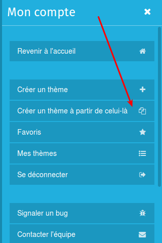
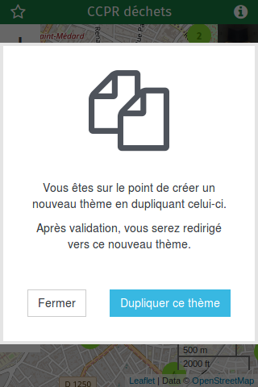
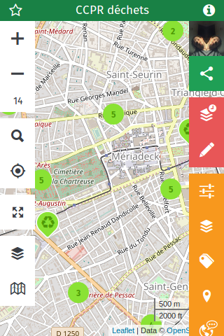
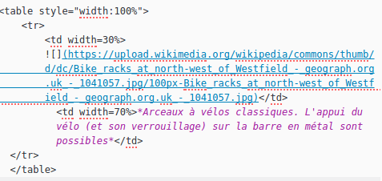

# Tutoriel / Créer un thème MapContrib

À l'instar d'[OpenBeerMap](http://openbeermap.github.io), d'[OsmHydrant](http://osmhydrant.org/) et de [wheelmap](https://wheelmap.org), MapContrib vise à faciliter la contribution à OpenStreetMap, par la création de thèmes en fonction des TOC (Troubles Obsessionnels Cartographiques) propre à chacun.
Ces thèmes se basent sur :
- une requête overpass (technique pour aller interroger une copie synchronisée de la base de donnée OpenStreetMap),
- la définition de "types de noeuds",

Ce tutoriel vise à accompagner la création d'un thème.
Les pré-requis pour pouvoir le faire sont :

- l'envie et/ou le besoin,
- [un compte OpenStreetMap](https://www.openstreetmap.org/user/new),
- connaître les tags (clé / valeur) dans [l'ontologie OpenStreetMap](https://wiki.openstreetmap.org/wiki/FR:Page_principale),
- connaître une requête [OverPass](http://overpass-turbo.eu/),

Quelques conseils !!!

- `Bien "penser" à ce que l'on veut voir, améliorer, ajouter avant de se lancer dans la requête, les tags, les modèles, la traduction !`,
- `Connaître les tags OpenStreetMap et avoir un peu regardé les différents cas sur le wiki`,
- `Commencer par un thème simple et une requête facile`

## Se rendre sur l'instance

- Pour ce tutoriel, l'instance utilisée est https://mapcontrib.xyz.

## Se connecter avec son compte OpenStreetMap
- Se rendre dans la colonne de paramètres,
- Se connecter en utilisant son compte OpenStreetMap,
- Accepter que MapContrib accède à votre compte OpenStreetMap,

### En images

## Créer un nouveau thème
- Se rendre dans la colonne de paramètres,

À noter :

- la possibilité de retrouver tous les thèmes que l'on a créé,
- la possibilité de retrouver ses favoris (des thèmes que l'on a créé ou pas, dont on souhaite garder la trace),

## Configurer le thème

Un thème porte un titre, peut s'ouvrir sur un territoire particulier et possède quelques options générales décrites ci-dessous. Toutes ses options sont modifiables par la suite.

### Trouver un lieu

- la `loupe` ou au clavier `Ctrl+f`

### Configuration

#### Nom du thème, description et couleurs

- `Nom du thème` / apparaît à la fois dans l'url et en haut du thème
  - si vous changez le titre, même une ancienne url fonctionne car le titre n'est pas pris en compte, seul le code (unique) sert à trouver le thème,
  - pas d'inquiétudes donc vous pouvez changer le nom de votre thème quand vous voulez :)
- `Description` / permet de décrire le sujet de votre thème. Lorsque ce champ est rempli, un i apparaît à coté du nom du thème et permet d'accéder à la description.

#### Positionnement et géolocalisation

- `Positionnement` / Enregistrer les paramètres actuels / permet de conserver la géolocalisation et le niveau de zoom pour une personne arrivant sur le thème,
- `Géolocalisation` / va demander l'autorisation de se géolocaliser à toute personne arrivant sur le thème,

#### Géocodeur, Affichage des informations et Statistiques

- `Géocodeur` / permet de définir le géocodeur utilisé lors des recherche (`Ctrl+f`). Par défaut, Photon est utilisé pour des raisons de fluidité.
- `Affichage des informations` / les informations des POI peuvent être affichées dans plusieurs types de fenêtres. Par défaut en colonne à droite, il est aussi possible de changer le comportement du thème en affichant :
  - des `Infobulles` / des `fenêtres modales`

### Fonds de carte

Cela permet de définir les fonds de cartes mis en avant par le créateur du thème. Les contributeurs auront cependant la possibilité d'en choisir d'autres, ceux définis par le créateur du thème sont simplement mis en avant.

## Créer une couche de données

Plusieurs couches de données peuvent être créées. Cependant, quelques précautions avant de créer une dizaine de couches différentes:
- dans les cas des couches "overpass" : **trop de couches simultanées renvoient des erreurs, les serveurs overpass n'appréciant pas d'avoir trop de requêtes provenant d'une même adresse "IP"**,
- dans les cas d'autres types de couches : **trop de données peuvent aussi saturer l'explorateur internet, c'est coté client que se passe les calculs !**

Donc 4 types de données peuvent être ajoutés :
 - des données provenant directement d'OpenStreetMap à travers une requête overpass (c'est le coeur de MapContrib),

Mais aussi pour permettre de faire des comparaisons avec les données OSM :
 - des données dans un fichier csv comportant des titres de colonnes longitude et latitude,
 - par un fichier GeoJSON,
 - par un fichier GPX,

### Nom, Description et Visibilité

- `Nom` / définit le nom de cette couche, telle que cela apparaît pour les contributeurs,
- `Description` / permet de mieux renseigner le contenu de la couche -> supporte le markdown !
	- exemple ci-dessous de l'insertion d'une image,
- `Visibilité` / va permettre au créateur de thème de préparer de nouvelles couches mais de ne pas les montrer aux contributeurs sur le thème,

### Représentation

Dans l'édition de la couche, la possibilité de personnaliser la `Représentation` sous forme de `Points groupables` ("clustering" par défaut) ou de `Carte thermique` (avec quelques options disponibles).

- l'opacité minimum de la couche

### Marqueur

Les `marqueurs` de chaque couche sont personnalisables :
- au niveau de la couleur et de la forme,
- avec une bibliothèque d'icônes,
- avec un lien vers une image extérieure (assurez vous d'avoir les droits d'utilisation de l'image),

### Contenu des bulles
Pour chaque couche, les informations associées peuvent être personnalisées. Pour cela, il faut définir le `Contenu des bulles` (le markdown est supporté).

De plus, quelque soit la source (overpass, csv, GeoJSON, GPX), les données peuvent être affichées de manière dynamique, en utilisant une clé entre accolade : {clé}.

La clé peut-être "l'en-tête" de colonne du fichier csv ou la clé du couple clé/valeur de l'ontologie OpenStreetMap.

### Couche requête overpass

Dans le cas d'une couche de type overpass, plusieurs autres personnalisations sont possibles.

#### Zoom minimum, Requête OverPass et Cache

- `Zoom minimum` / définit la valeur à laquelle la requête overpass se déclenche,
- `Requête OverPass` / Zone pour l'exécution de la requête
	- le temps de requête maximum (timeout) est limité à 120 secondes,
	- la taille maximale de données rapatriés est limitée à 1 Mo !
- `Le cache`
	- `activer le cache` présente des avantages et des inconvénients
		- les données se chargent plus rapidement (la requête overpass n'est pas exécutée, les données sont téléchargées depuis leur stockage en cache sur nos serveurs) mais se mettent à jour moins régulièrement (la requête est relancée une fois par jour pour mise à jour),
		- sur un thème dont le cache est activé, une étoile jaune signale l'ajout d'une donnée depuis le thème aux autres utilisateurs du thème,
  - `activer l'archivage du cache` permet de décider si les points supprimés dans OpenStreetMap sont retirés de l'affichage du cache qui est fait dans le thème de MapContrib
    - cela concerne surtout une fonction d'affichage sur un site institutionnel, pour permettre à l'institution d'avoir un contrôle sur l'affichage sur son site (bien évidemment sans modération dans la base OpenStreetMap)

### Tester sa requête
Selon le zoom minimum défini, la requête peut ne pas se déclencher à l'ouverture du thème. Il faudra alors zoomer pour permettre le déclenchement.

### Cas des autres formats de fichiers (csv, GeoJSon, GPX))
`Nom, Description, Visibilité, Représentation (groupable ou thermique), Marqueur et Contenu des bulles` fonctionnent de la même manière.
Cependant les données importées ne seront ni modifiables, ni déplaçables et n'ont pas d'interactions avec la base de données OpenStreetMap.

Ces données importées peuvent ainsi être comparées aux données OpenStreetMap.

#### CSV, GeoJSON, GPX

Quelques contraintes :
- le poids des fichiers ne doit pas dépasser 2 MB,
- dans le cas du fichier csv, les colonnes de localisation doivent être nommées latitude et longitude,

## Configurer ses tags

La configuration des tags va permettre par la suite de les utiliser :
- pour la traduction des types de noeuds ("modèles" / "presets") : voir paragraphe suivant)
- pour l'appel dynamique dans les bulles ("pop-ups") et donc pour la traduction dans les données dynamiques : cela permet ainsi d'avoir une interface sans aucun mot étranger (souvent un frein pour les contributeurs ni geek ni cartographe ni contributeur).

Vous pouvez créer autant de tags que nécessaire, cependant n'oubliez pas de garder le lien avec la requête overpass... Bien "penser" ce que l'on veut voir, améliorer, ajouter avant de se lancer dans la requête, les tags, les modèles, la traduction !

- `Type` / permet de définir différents formats que l'on retrouvera ensuite dans les **Types de noeuds** et différentes présentations !

	- Cases à cocher
	- liste déroulante avec traduction

## Définir les types de noeuds, "modèles"

Les types de noeuds permettent de définir à la fois :
- les tags pré-remplis qui pourront être utilisés pour compléter, qualifier des données existantes (fusion des tags entre le noeud existant et le type de noeud),
- les tags pré-remplis qui pourront être ajoutés lorsque un noeud est manquant,

Cela se traduit donc pour le contributeur en un noeud "pré-rempli" :

## Traduire son thème

Après avoir rempli l'ensemble des informations il est possible de traduire les thèmes pour qu'il soit adapté en fonction de la langue du navigateur.

L'absence de traduction d'une langue entraîne l'utilisation des chaînes de caractères par défaut. Par défaut remplir les champs comme indiqué ci-dessus, puis traduire seulement les éléments nécessaires / souvent **tags** !).

Si vous avez écrit en français sauf les tags, il n'est pas nécessaire de remplir les éléments de traduction concernant la configuration générale, les couches ou les types de noeuds. En l'absence de traductions, ceux sont les contenus écrit initiaux qui sont affichés.

Ces traductions seront cependant nécessaires pour que cela fonctionne dans d'autres langues.

## Quelques exemples de thèmes

- n'oubliez pas que vous pouvez dupliquer un thème, en devenir "administrateur" et ainsi pouvoir le disséquer pour comprendre,

  - les bornes à incendies,
  - les bornes de recyclages,
  - ...

## Quelques ressources complémentaires

### La requête overpass-turbo

1. Définir le tag que l'on souhaite trouver
1. Aller sur [l'assistant](http://overpass-turbo.eu/)

  

1. Renseigner son tag et construire la requête
1. Tester sur de petites zones
1. Lorsque la requête fonctionne, faire un copié-collé dans MapContrib

Dans `Charger`, il y a plusieurs exemples qui permettent de construire la requête overpass.

- pour plus d'infos :
  - http://wiki.openstreetmap.org/wiki/FR:Overpass_turbo
  - http://wiki.openstreetmap.org/wiki/FR:Overpass_API/Overpass_QL

### Écrire en markdown

- https://fr.wikipedia.org/wiki/Markdown

#### insérer une table en markdown

- l'html est interprété, on peut donc insérer une table si on le souhaite. Cela peut aider pour mieux présenter différents champs descriptifs de MapContrib.

Ici un tableau en html :

Cela donne ceci :

<table style="width:100%">
    <tr>
        <td width=30%> </td>
          <td width=70%>*Arceaux à vélos classiques. L'appui du vélo (et son verrouillage) sur la barre en métal sont possibles*</td>
  </tr>
  </table>
